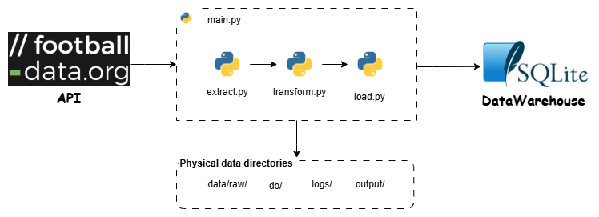
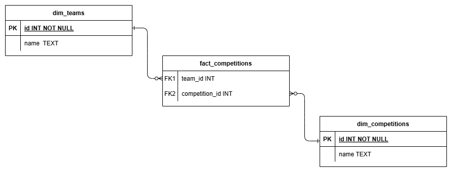

# 👋 Introduction

**This project is designed to demonstrate a data engineering pipeline that ingests data from an API, processes and transforms it, and loads it into a relational database. 
Finally, output a CSV file summarizing the number of teams per competition in descending order.**


## Table of Contents
1. [ETL Process](#etl-process)
2. [Datawarehouse](#datawarehouse)
3. [Repository Structure](#repository-structure)
3. [Quick Start](#quick-start)
4. [Requirements](#requirements)

## ETL Process
The ETL Process is entirely writing in python, compost by 4 files mainly:

1. The [main.py](app/main.py) file acts like an ETL orchestrator, its resposanble to run the whole process in the write execution order. 
Also it is responsable to generates the summary.csv file asked in fouth part of this assessment.

2. The [extract.py](app/etl/extract.py) file is responsable to hit the [API football-data.org](https://www.football-data.org/) and write the raw data inside the [data/raw/](data/raw/) directory of this repository.
It generates mainly the file **competitions.json** that stores all competitions and the **teams_<$competition_code>.json** files that stores the teams for which competition.

3. The [transform.py](app/etl/transform.py) receives the list of dictionaries from previous step and pcess all the transformations and them returns 3 pandas dataframe, one for each table in the datawarehouse.

4. The [load.py](app/etl/load.py) is responsable to create database connection, drop the tables if them already exists, create the table and them load dataframe received from previous step in your respective table.


###
**NOTE**: _FREE API SUBSCRIPTION only handles 10 requests per minute, so this script is prepared to wait 60 seconds after receive back the status code 429_.
####


## Datawarehouse
The ETL process creates a data warehouse as illustrated below with 2 dimensional tables (dim_competitions / dim_teams) and the fact table fact_competitions 
that stores the records of teams that played in each of the competitions:



## Repository Structure
The project structure is organized as follows:

```
ETL_API_FOOTBALL/
├── app/
│   ├── __init__.py
│   ├── main.py
│   ├── etl/
│       ├── __init__.py
│       ├── extract.py
│       ├── transform.py
│       └── load.py
├── tests/
│   ├── __init__.py
│   ├── test_extract.py
│   ├── test_transform.py
│   └── test_load.py
├── data/
│   └── raw/
├── db/
│   └── football_data.sql
├── output/
│   └── summary.csv
├── log/
│   └── etl.log
├── .env
├── requirements.txt
├── README.md
```


- **app/**: Contains the main application code.
    - **main.py**: The entry point for running the ETL pipeline.
    - **etl/**: Contains the ETL process scripts.
        - **extract.py**: Handles data extraction from the API.
        - **transform.py**: Manages data transformation logic.
        - **load.py**: Responsible for loading data into the database.

- **tests/**: Contains unit tests for the ETL process.
    - **test_extract.py**: Tests for the extraction process.
    - **test_transform.py**: Tests for the transformation process.
    - **test_load.py**: Tests for the loading process.

- **data/**: Directory for storing raw data files.
    - **raw/**: Subdirectory for raw data files.

- **db/**: Directory for database-related files.
    - **football_data.sql**: SQLite database.

- **output/**: Directory for storing output files.
    - **summary.csv**: CSV file summarizing the number of teams per competition.

- **log/**: Directory for storing log files.
    - **etl.log**: Log file for the ETL process.

- **.env**: Environment variables file containing sensitive information like API keys.

- **requirements.txt**: Lists the Python dependencies required for the project.

This structure ensures a clear separation of concerns, making the project easy to navigate and maintain.


## Quick Start

1. **Clone the repository:**
    ```bash
    git clone <repository_url>
    cd <repository_directory>
    ```

2. **Obtain API Token:**
    Register for a free API token [here](https://www.football-data.org/client/register).

3. **Configure Environment Variables:**
    Create a `.env` file in the root directory with the following content:
    ```bash
    API_KEY=<your_api_token>
    ```

4. **Set Up Virtual Environment and Install Dependencies:**
    ```bash
    python3 -m venv venv
    source venv/bin/activate
    pip install -r requirements.txt
    ```

5. **Run the Pipeline:**
    ```bash
    python app/main.py
    ```

6. **Run Tests (Optional):**
    ```bash
    python -m pytest .
    ```

7. **Check Test Coverage (Optional):**
    ```bash
    python -m pytest --cov=. --cov-report=term-missing
    ```

## Requirements

- Python 3.10 or higher (This project was built with Python 3.13.1)


